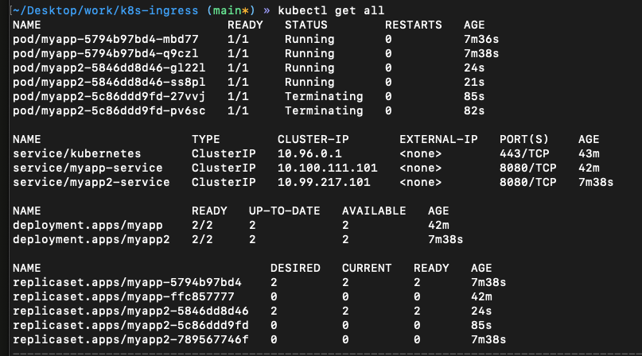
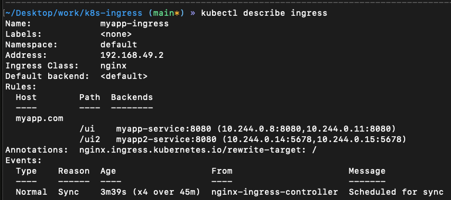
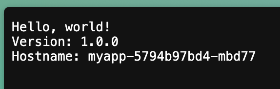
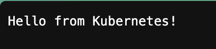

# Ingress In Kubernetes

This repo aims to give you the basic understanding on how to configure an ingress controller on a k8s cluster.

We won't go into the detail about what ingress controller is for and the different types of controllers - we'll be using nginx as our controller for this demo.

We will use minikube to create our demo cluster.

## Prerequisites
- [minikube](https://minikube.sigs.k8s.io/docs/start/?arch=%2Fmacos%2Farm64%2Fstable%2Fbinary+download)
- [docker](https://www.docker.com/)
- [kubectl](https://kubernetes.io/docs/reference/kubectl/)

## Getting Started 

### 1. Setup the Cluster and Ingress Controller

Start our minikube cluster:
```bash
minikube start
```

Install ingress on minikube (this automatically starts the K8s Nginx implementation of Ingress Controller):
```bash
minikube addons enable ingress
```

Verify the nginx ingress controller pod is running:
```bash
kubectl get pods -n ingress-nginx
```

### 2. Deploy Sample Applications

Let's deploy 2 different hello world apps on our cluster so we have something to reach:
```bash
kubectl apply -f manifest/myapp -f manifest/myapp2
```

Check that our `myapp` and `myapp2` pods and services have been deployed successfully:
```bash
kubectl get all
```

You should see internal services for both `myapp` and `myapp2` deployments.



### 3. Configure Ingress Rules

Now let's configure an ingress rule for our `myapp` and `myapp2` so we can access them from a browser using a domain name.

Take a look inside our [manifest/ingress/](manifest/ingress/) folder - we have an ingress rule yaml already defined there with comments explaining what each line does.

Apply the ingress configuration:
```bash
kubectl apply -f manifest/ingress
```

Check that our ingress is created:
```bash
kubectl get ingress
```

The address might be empty initially - it's normal that it takes a bit of time to assign an address to ingress. Let's watch it:
```bash
kubectl get ingress --watch
```

Once an address is assigned, let's describe our ingress and take a look:
```bash
kubectl describe ingress
```



### 4. The Docker driver problem (and the fix)

We don't actually own [myapp.com](myapp.com), so eventually we'll map it in `/etc/hosts`. But first, try to curl the ingress IP:

```bash
curl --max-time 5 http://192.168.49.2:80
```

It timed out. Why? We did everything right…

Because with the Docker driver:
- Minikube runs inside a Docker container (on my Mac)
- `192.168.49.2` is the container's IP on Docker's internal network
- The host (my Mac) can't directly reach Docker container IPs
- So `curl http://192.168.49.2:80` times out from the host

The simple fix: tunnel traffic from the host to the cluster.

1) In a separate terminal, start the tunnel:
```bash
minikube tunnel
```

2) Map the domain locally so the browser sends the right Host header:
```bash
sudo vi /etc/hosts
```
Add this line:
```
127.0.0.1       myapp.com
```

Now, “how does Minikube know which ingress to route to if `myapp.com` resolves to `127.0.0.1`? The ingress IP was `192.168.49.2`, right?”

What `minikube tunnel` does is create a route from `127.0.0.1` to the `ingress-nginx-controller` service. The NGINX ingress controller then looks at the `Host: myapp.com` header and:
- Scans all Ingress resources
- Finds `myapp-ingress` with `host: myapp.com`
- Routes the request to `myapp-service:8080` (or another backend based on path)

This is what's happening under the hood:

```bash
Browser Request:
http://myapp.com/ui
Host: myapp.com

↓ (DNS: myapp.com → 127.0.0.1)

127.0.0.1:80 
↓ (minikube tunnel)

Ingress Controller (single pod)
↓ (examines Host header & path)

if Host == "myapp.com":
    if path starts with "/ui2" → myapp2-service:8080
    if path starts with "/ui"  → myapp-service:8080
```

So when we type [myapp.com](myapp.com) in the browser, the request reaches the cluster, the ingress controller evaluates our rules in [manifest/ingress/myapp-ingress.yaml](manifest/ingress/myapp-ingress.yaml), and forwards to the right service.

### 5. See it working

Open the browser and hit the first app: [http://myapp.com/ui](http://myapp.com/ui)



Now the second app: [http://myapp.com/ui2](http://myapp.com/ui2)

